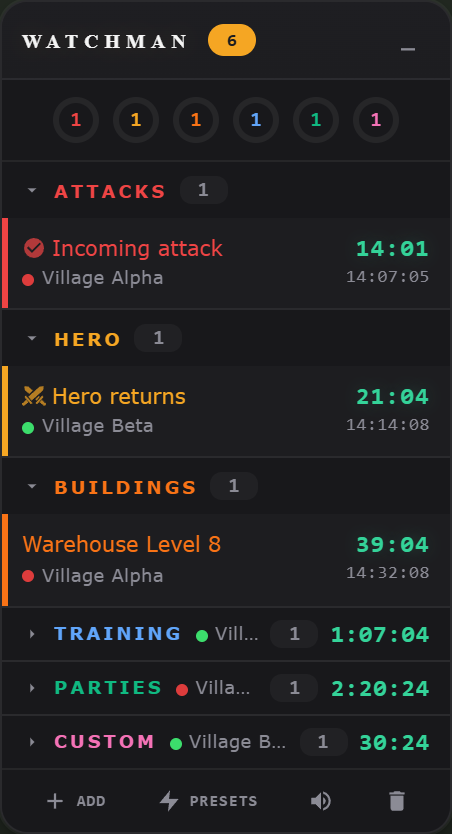

# Travian Extensions

Eight independent browser extensions for Travian: find oases, manage farm-list selections, track rankings, plan culture points, keep timers visible, and customize the interface.

**Community beta · Install only the extensions you want · Discord support: `luckimikey`**

These are the current versions used by the maintainer in Brave. They are shared for players to try and give feedback. The screenshots show the real extension interfaces with **sample data**; they do not show a live account. This is an unofficial project, unaffiliated with Travian Games.

## What's included

| Extension | Version | What it does | Load this folder |
| --- | --- | --- | --- |
| [Oasis Finder](#oasis-finder) | 69.3 | Scores nearby oases for hero and troop raids; improves oasis farm-list sorting | `extensions/OasisCalc` |
| [TravAlarm / Watchman](#travalarm--watchman) | 3.25 | Groups game timers and custom reminders in a floating dashboard | `extensions/travAlarm` |
| [Travian QoL](#travian-qol) | 1.0 | Farm-list selection, bulk tab opening, report tools, loot calculator, to-do list, and more | `extensions/TravianQoL` |
| [Rank Tracker](#rank-tracker) | 4.8.0 | Records statistics and shows rankings, deltas, and history graphs | `extensions/TravianRankTracker` |
| [CP Predictor](#cp-predictor) | 2.3 | Estimates when you will reach the next settlement's culture-point requirement | `extensions/NextSettlementCalc` |
| [NPC AutoMerchant](#npc-automerchant) | 3.1.0 | Calculates troop resource needs and helps prepare hero resource transfers | `extensions/automerchant` |
| [InactiveSearch Map Opener](#inactivesearch-map-opener) | 5.1 | Collects filtered inactive targets across pages and opens their Travian map tabs | `extensions/inactiveOpenerV3` |
| [Night Mode](#night-mode) | 2.0 | Darkens Travian and adds a button-color picker with saved favorites | `extensions/travian_night_mode` |

No build tools or paid extension subscription are needed. Features that depend on Travian's own paid options still require those options in the game.

## Install in Brave, Chrome, or Edge

1. Click **Code → Download ZIP** at the top of this repository, then extract it to a folder you will keep. Alternatively, clone the repository.
2. Open your browser's extension manager:
   - Brave: `brave://extensions`
   - Chrome: `chrome://extensions`
   - Edge: `edge://extensions`
3. Turn on **Developer mode**.
4. Click **Load unpacked** and select **one extension's folder** from the table above. Select the folder that contains that extension's `manifest.json`, not the repository root.
5. Repeat for any other extensions you want, then refresh your open Travian tabs.
6. Pin extensions with popups to your toolbar. Oasis Finder, Watchman, NPC AutoMerchant, and InactiveSearch instead add controls directly to their matching pages.

Start with Night Mode and QoL if you want a quick introduction, then add the other tools as you need them. Each extension can be disabled separately. Avoid running older copies of the same tool alongside these versions.

**Browser support:** these packages target desktop Chromium browsers. Brave is the maintainer's current browser; Chrome and Edge compatibility still needs community feedback. Firefox installation is not documented for this release.

**Server support:** Oasis Finder, Watchman, CP Predictor, and NPC AutoMerchant currently target `*.travian.com`. Rank Tracker additionally matches `.org`, `.net`, `.us`, and `.de`. QoL and Night Mode match several regional domains; their manifests contain the complete lists. InactiveSearch Map Opener runs on `inactivesearch.com` and `inactivesearch.it`. A similar-looking unsupported domain will not receive the interface.

### Updating and keeping your settings

Download the new version, replace the files in the **same installed folder**, and click **Reload** on its extension card. Refresh the game tabs afterward. Keep that folder at the same path to preserve the unpacked extension's identity and stored data. Removing/reinstalling an extension or moving its folder can lose settings/history; Rank Tracker's JSON export is useful before changing installations.

## Oasis Finder

**Features:** draggable, collapsible map panel; Discovery and Update modes; scan-coverage meter and local oasis database; observation-age labels; Hero and Troops views; hero-stat fetch and adjustments; troop counts and smithy levels; optional hero inclusion; troop preview and maximum troop cap; five risk levels; sorting by best score, net resources, resources/minute, distance, or resources/HP; compact/normal/detail layouts; database and error viewers. The native farm list also sorts same-named oasis targets by bonus type, then by distance within each type.

**Use it effectively:**

1. Open the Travian **map**. Pick the village you will raid from and set a manageable radius.
2. Use **Discovery** and pan the map around that village. The extension observes map data as it loads; the coverage meter shows what has been seen. Switching to **Update** helps refresh oases already known to the database.
3. In **Hero**, click **Fetch** to read current hero information, then use **Adjust** to check health, Tournament Square level, and map return-speed bonus. Stale or incorrect hero values change the estimates.
4. In **Troops**, fetch or enter available troop counts and smithy upgrades. Choose whether to include the hero, the preview unit, and an optional troop cap.
5. Begin with a conservative risk setting. Compare **Res / minute** for repeated short trips or **Res / HP** when protecting hero health. **Net resources** accounts for modeled losses; the highest gross loot is not always the best target.
6. Check the observation-age label and open a target to check its current garrison before deciding to raid. Clicking coordinates opens its map location; **Send** opens a prefilled rally-point page for review, rather than immediately launching a raid. The results are estimates from cached observations, not a guarantee of the next battle's outcome. Readings with unknown age or incomplete animal data are excluded from the recommendation list.

Use **View DB** to inspect stored targets and **Errors** when a scan looks incomplete. **Clear DB** removes the local oasis cache, so expect to discover the area again afterward.

## TravAlarm / Watchman

**Features:** floating timer dashboard with category rings and village colors; discovered attack, hero, construction, training, storage, celebration, and farm-list timers; custom reminders; reusable presets including recurring/daily modes; countdowns and completed states; pinning, deletion, collapse/minimize controls; category-specific sound controls and volume; browser alarms and notifications.

**Use it effectively:**

1. Open Travian and find the **Watchman** panel. Visit relevant game pages so the extension can read the timers and village data it needs. Timers depend on available page/server information.
2. Expand a category to see its individual alarms; use the village label/color to tell villages apart. Move or minimize the panel if it covers a game control.
3. Click **Add** for a manual reminder. A plain number means minutes: `15` is fifteen minutes; `1:30` is one minute thirty seconds; `0:45:00` is forty-five minutes. A clock time such as `10pm` schedules the next occurrence of that time on your computer's clock.
4. Use **Presets** for reminders you repeatedly create, and the timer controls to pin or dismiss items. Open **Sound Settings** to choose useful categories and set volume.
5. Keep the browser running and allow its notifications if you want desktop alerts. Computer sleep, closed browsers, expired sessions, and muted system audio affect timeliness or sound.

The village-navigation fix in this package keeps ordinary menu clicks from being interpreted as an intentional village change while the extension refreshes data.

## Travian QoL

Click the toolbar icon for settings, or open the extension's **Options** page for a larger view. Features are enabled by default and individually toggleable. **Hot-toggle** features can be changed live; **On refresh** features need a page refresh. Loot Calculator, Skip Ads, and Counter-attack have their own settings tabs.

| Feature | How to use it effectively |
| --- | --- |
| Farm-list multi-select | Click a checkbox to set an anchor, then use **Shift-click** for a range or **Ctrl/Cmd-click** to toggle a target from its row. The checked rows are highlighted. Shift uses the opposite of the anchor's checked state, so check the resulting range before using Travian's raid button. Clicking outside the lists clears selection. |
| Open selected farm targets | With targets checked, **right-click a checked row → Open N selected targets in tabs**. Opens unique map links from that same list in background tabs; other lists are excluded. It does not send raids. Escape, scrolling, or clicking elsewhere closes the menu. |
| Farm-list bounty sort | Choose **By bounty** in the native sorting control. Targets stay ordered by last bounty descending, with distance ascending for ties, through list re-renders. Choosing a different sort ends this behavior. |
| Adventure distance sort | Open the hero adventure list; nearest adventures are placed first. |
| Village resource grand-total | On the per-village resource/production statistics page, look beside each village's name for its wood + clay + iron + crop total. |
| Open unread reports | On the reports page, use **Open Unread** beside Archive to open unread reports from the displayed page in background tabs. This can create many tabs; narrow the visible list first. |
| Loot Calculator | Select resource text, right-click, and choose **Calculate Troops Needed**. Set tribe and carrier unit to get the troop count needed for that amount. Report loot values also receive unit-count badges. Configure default/per-server unit choices in the **Loot Calculator** settings tab. |
| In-game to-do list | Use the floating checklist for tasks, village-specific lists, editing, completion, and reordering. Drag or collapse it to keep it out of the way; tasks are saved locally. |
| Skip builder-bonus ads | Enable the feature and use the game's builder-bonus video flow. It mutes/skips supported ad players; timing controls are under **Skip Ads**. Ad providers can change, so report unsupported playback. |
| Counter-attack calculator | Open **Counter-attack** in Options, enter coordinates, troop speed, server speed, relevant bonuses, and attack timings to plan return/interception times. Check these inputs against the game before acting. |

The farm-list screenshot uses a sample table around the real extension's selection highlight and menu. The in-game table's appearance varies by theme and game version.

## Rank Tracker

**Features:** weekly Top 10 and general rankings; population, resource production, culture points, attack/defense, and raid/PvE statistics; colored percentile rank tiers; deltas against earlier observations; average general rank; interactive history graphs; raw observations or daily peaks; absolute values or hourly velocity; dataset groups, visibility controls, zoom and point comparisons; multiple remembered servers; JSON export/import.

**Use it effectively:**

1. Open a logged-in Travian game tab, then click the extension icon. This discovers the server and fetches your first statistics.
2. **Current** shows cached data immediately and refreshes it. Check the update status before treating numbers as current. The background worker requests new observations approximately every thirty minutes while the browser can run and the session remains valid.
3. Return over time: **History** becomes useful once there are multiple observations. Select a metric/group, use **Daily Peaks** for a cleaner long view, and use **Velocity** to inspect the rate of change.
4. Use chart zoom and point selection to compare periods. Weekly statistics reset, so compare equivalent periods rather than assuming every decrease is lost progress.
5. Use the save icon to **Export All Data** regularly. The folder icon imports a JSON backup; back up the existing installation first because restore writes saved tracker data.

If you see a session-expired message or a gap in the chart, log back into that server and reopen the popup. The tracker cannot reconstruct observations that were never recorded.

## CP Predictor

**Features:** measured CP total/daily production; selectable settlement threshold; estimated ETA; per-village Town Hall levels and small/large celebration plans; current celebration cooldowns; repeated planned celebration queues; passive-growth projection when sufficient observations exist; baseline forecast; readiness alarm/mute; remembered servers; refresh and forecast-log export.

**Use it effectively:**

1. Open a logged-in game tab and the extension popup (**CP Planner**). Choose the server and target settlement threshold, then **Refresh** if the data is old.
2. Check village CP production and Town Hall levels. Select the small/large celebrations you intend to keep running. If both are selected, the planner models its small-then-large sequence and waits for the necessary cooldowns.
3. Compare the planned ETA with the baseline to see what celebrations contribute. Plans assume you can supply the resources and start the parties when scheduled; the extension does not start them for you.
4. A currently running celebration's reward has already been paid at its start and is not counted again at its finish. Passive production growth needs readings spanning at least twelve hours; do not expect a meaningful growth model immediately after installing.
5. Use the alarm control for CP readiness. Notifications are based on observed/passive CP, rather than treating unstarted planned celebrations as completed. Actual settlement also requires settlers, a free expansion slot, and any other game conditions.

The popup and background refresh roughly every five minutes. Failed refreshes retain the last saved snapshot, so check freshness. Export the forecast log when reporting an implausible ETA.

## NPC AutoMerchant

Despite the historical name, the current NPC panel centers on **Troop Calc**. It is not a general scheduled merchant-route tool.

**Features:** tribe/server-ruleset detection with manual overrides; selected troop cost; maximum buildable count from the NPC resource pool; editable build amount and **Max**; per-resource totals and copy buttons; village resource deficits; **Send to Indicator**; **Pull from Hero**; saved/movable resource indicator and hero-transfer assistance.

**Use it effectively:**

1. Open a troop-training building and click the game's **NPC exchange** control for the troop you want. The helper uses that unit context when the NPC dialog opens. Opening a generic NPC dialog without a troop context may not show it.
2. Check the tribe and server selector: **3 Tribes Classic**, **5 Tribe**, or **6 Tribe Rebalanced**. Incorrect costs produce incorrect resource needs.
3. Enter the desired **Build amount** or press **Max**. Max is the theoretical count using the total NPC pool and an optimal split; it is not a promise that your current stock distribution or training queue can recruit it immediately.
4. Copy individual resource totals when useful. **Send to Indicator** saves the per-resource shortfall for the floating indicator. **Pull from Hero** normally opens the game's resource-transfer dialog in place with the required target amounts; inspect the amounts and destination before confirming.
5. On legacy pages where the native transfer dialog is unavailable, the helper can navigate to hero inventory and fill/submit a transfer through its fallback flow. Use it only when you intend to transfer those resources; check the resulting village stock afterward.

It does not need your password or a separate login. The old Needs/Ratio tab instructions from earlier versions do not apply to this package.

## InactiveSearch Map Opener

**Features:** floating controls on InactiveSearch; local population sorting in either direction; collection across filtered result pages (up to 100 pages); addition to InactiveSearch's saved farmlist; queued Travian map-tab opening; background/foreground preference; Stop control and progress status.

**Use it effectively:**

1. Open your world's results on **InactiveSearch** and set distance, inactivity, and population filters on the site first. Verify that its links point to the correct Travian world and log into that world in the browser.
2. Use **Sort by Population** to reorder the displayed results if needed. This sorts the current page, not a fresh global search across every result.
3. Keep **Open in background** checked to preserve your current tab. Click **Start All Pages** when ready: it collects the filtered pages, adds targets to the site's saved farmlist, and queues their map tabs.
4. Use **Stop** to cancel pending collection/opening. Tabs already opened remain open. Use narrow filters first to avoid hundreds of tabs.

Adding to the **InactiveSearch** farmlist does not create or populate a native Travian farm list. Complete any in-game farm-list setup yourself.

## Night Mode

**Features:** dark theme for game pages, dialogs, and common controls; enabled by default; instant toolbar toggle; custom button-color picker with hex entry; up to twelve saved favorites; live color preview and reset to the game's native button colors.

**Use it effectively:**

1. Install and refresh Travian. Click the toolbar icon to switch **Night Mode** on/off; the preference applies to matching open tabs.
2. Choose a button color using the square and hue strip, or enter a hex color. This customizes supported buttons rather than recoloring every game asset.
3. Use **+** to save the current color, click a favorite to reuse it, and remove a favorite with its small delete control. **Reset to default** restores native button colors while keeping the dark theme available.
4. If a game update makes text or controls unreadable, temporarily disable Night Mode and send the page/screenshot to `luckimikey`.

## Data and permissions

Preferences, timers, histories, and caches are stored in the browser's extension storage; some helpers also use page local/session storage for village context and transfer state. QoL feature toggles use browser sync storage when sync is available. There is no project-operated account, subscription backend, or analytics service in this package.

Tools that refresh game statistics use your existing logged-in game session. InactiveSearch interacts with that site's results/farmlist. QoL and Watchman can open tabs or show notifications, and AutoMerchant can prepare resource transfers. Some interface styles load Google Fonts, and Night Mode references a Travian-hosted button asset. Browser permissions differ by extension; inspect each `manifest.json` and install only what you want.

## Troubleshooting and feedback

- **No UI:** check the server/domain support above, that the extension is enabled, and that you selected its own folder when loading. Refresh the game page after installing/reloading.
- **Old data:** confirm you are logged into the correct world, reopen the relevant popup, and check its refresh/status display. Gaps during browser shutdown or expired sessions are expected.
- **A feature conflicts with another extension:** disable the overlapping tool or toggle the relevant QoL feature, then refresh.
- **After updating:** use Reload in the extension manager and refresh all affected game tabs. If an error remains, copy its text from the extension card's Errors view.

**Reach out on Discord: `luckimikey`**, or [open a GitHub issue](https://github.com/mikeywikey-coding/travian-extensions/issues/new/choose). Include the extension name/version, browser/version, server domain, steps to reproduce, expected vs. actual behavior, and a screenshot or error message. Blur account details you do not want to share. Never send passwords, cookies, or session tokens.

Feature requests and small pull requests are welcome. For development, edit the extension files directly, reload the unpacked extension, and refresh the relevant page. Each extension is separate; changes should stay focused on its own folder.

## Sharing with your Discord community

See [the ready-to-copy Discord invitation](docs/DISCORD-POST.md). You can link this repository directly; there is no need to distribute separate archives for each extension.

## Credits

Travian and its game artwork belong to their respective owners. Rank Tracker bundles Chart.js, whose license notice is retained in `chart.js`. The QoL builder-bonus ad helper credits DUDSS in its source. Existing source attribution is preserved. Public availability does not change third-party ownership or imply affiliation with the game.
