# Travian Extensions

Eight standalone browser extensions for Travian.

**Community beta · Discord: `luckimikey`**

## Disclaimer

Use these extensions at your own risk. I am not liable for any bans or account penalties resulting from their use. I have tested them for several months without issues, but this does not guarantee that you will avoid a ban.

<a href="docs/images/oasis-finder.png">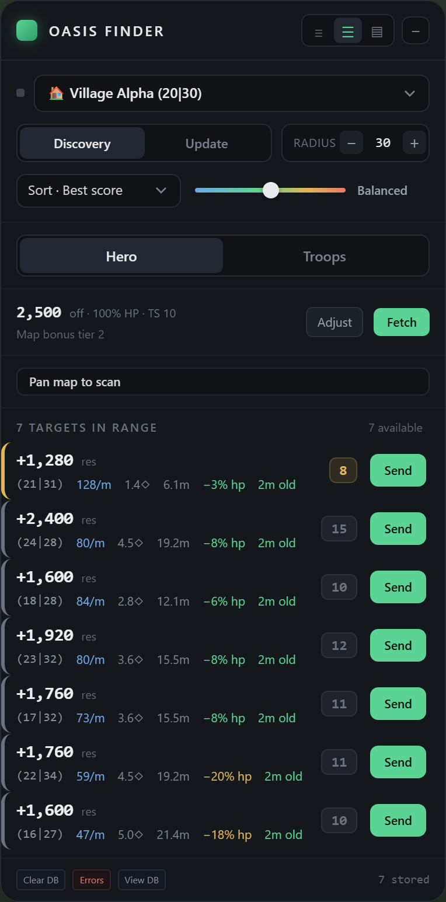</a>

Screenshots use sample data. Unofficial project, unaffiliated with Travian Games.

## Extensions

| Extension | Version | What it does | Load this folder |
| --- | --- | --- | --- |
| [Oasis Finder](#oasis-finder) | 69.3 | Scores nearby oases for hero and troop raids; improves oasis farm-list sorting | `extensions/OasisCalc` |
| [TravAlarm](#travalarm) | 3.25 | Groups game timers and custom reminders in a floating dashboard | `extensions/travAlarm` |
| [Travian QoL](#travian-qol) | 1.0 | Farm-list selection, bulk tab opening, report tools, loot calculator, to-do list, and more | `extensions/TravianQoL` |
| [Rank Tracker](#rank-tracker) | 4.8.1 | Records statistics and shows rankings, deltas, and history graphs | `extensions/TravianRankTracker` |
| [CP Predictor](#cp-predictor) | 2.3 | Estimates when you will reach the next settlement's culture-point requirement | `extensions/NextSettlementCalc` |
| [NPC AutoMerchant](#npc-automerchant) | 3.1.0 | Calculates troop resource needs and helps prepare hero resource transfers | `extensions/automerchant` |
| [InactiveSearch Map Opener](#inactivesearch-map-opener) | 5.1 | Collects filtered inactive targets across pages and opens their Travian map tabs | `extensions/inactiveOpenerV3` |
| [Night Mode](#night-mode) | 2.4 | Darkens Travian and adds a button-color picker with saved favorites | `extensions/travian_night_mode` |

## Install in Brave, Chrome, or Edge

1. Select **Code → Download ZIP** and extract the archive, or clone the repository.
2. Open `brave://extensions`, `chrome://extensions`, or `edge://extensions`.
3. Enable **Developer mode**.
4. Select **Load unpacked**, then choose an extension folder containing `manifest.json` from the table above.
5. Repeat for each extension you want to install. Refresh Travian tabs.
6. Pin extensions with toolbar popups. Oasis Finder, TravAlarm, NPC AutoMerchant, and InactiveSearch add controls to their matching pages.

No build step is required. Game features requiring a paid Travian option still require that option.

**Browsers:** desktop Chromium. Used in Brave; Chrome and Edge compatibility needs feedback. Firefox installation is not covered.

**Domains:** Oasis Finder, TravAlarm, CP Predictor, and NPC AutoMerchant target `*.travian.com`. Rank Tracker also supports `.org`, `.net`, `.us`, and `.de`. QoL and Night Mode support multiple regional domains; see their manifests. InactiveSearch Map Opener runs on `inactivesearch.com` and `inactivesearch.it`.

### Updating and keeping your settings

Replace the files in the same installed folder, click **Reload** in the extension manager, and refresh game tabs. Moving or reinstalling an extension can lose saved data. Export Rank Tracker data before changing installations.

## Oasis Finder

**Features:** Discovery/Update modes, scan coverage, local oasis database, observation ages, Hero/Troops views, hero-stat fetch, troop counts and smithy levels, optional hero inclusion, troop preview/cap, five risk levels, sort controls, density controls, draggable/collapsible panel, database and error viewers. Native farm-list name sorting groups oases by bonus type, then distance.

**Usage:**

1. Open the map, select the origin village, and set the radius.
2. Select **Discovery** and pan the map to collect oasis data. Use **Update** to refresh known targets. The coverage meter shows observed areas.
3. In **Hero**, click **Fetch** and check health, Tournament Square level, and map bonus under **Adjust**. In **Troops**, fetch or enter counts and smithy levels; set hero inclusion, preview unit, and troop cap.
4. Choose a risk level and sort: **Best score**, **Net resources**, **Res / minute**, **Distance**, or **Res / HP**. Net resources includes modeled troop losses.
5. Check observation age and current garrison before raiding. Coordinates open the map; **Send** opens a prefilled rally-point page. Sending the raid requires confirmation in the game.

Unknown-age or incomplete readings are excluded. **View DB** shows stored targets, **Errors** shows scan problems, and **Clear DB** deletes the oasis cache.

<a href="docs/images/oasis-troops.png">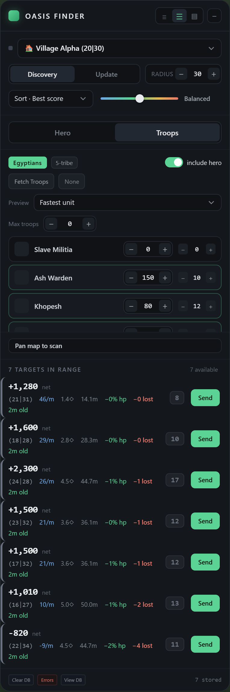</a>

## TravAlarm

<a href="docs/images/travalarm.png">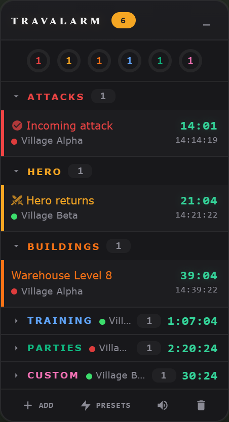</a>

**Features:** grouped timers for attacks, hero movements, construction, training, storage, celebrations, and farm lists; village labels/colors; custom reminders; recurring/daily presets; countdowns; pin/delete controls; draggable/collapsible panel; category sound settings; volume; browser alarms and notifications.

**Usage:**

1. Open Travian and visit the relevant game pages to populate timers. Expand a category to view its alarms.
2. Click **Add** for a custom reminder. Durations: `15` = 15 minutes, `1:30` = 1 minute 30 seconds, `0:45:00` = 45 minutes. `10pm` schedules the next occurrence on your computer's clock.
3. Use **Presets** for reusable reminders. Pin or delete timers with their controls.
4. Set volume and enabled categories under **Sound Settings**. Allow browser notifications for desktop alerts.

Timers depend on available game data. Browser shutdown, computer sleep, expired sessions, and muted audio can affect alerts.

## Travian QoL

<a href="docs/images/qol-settings.png">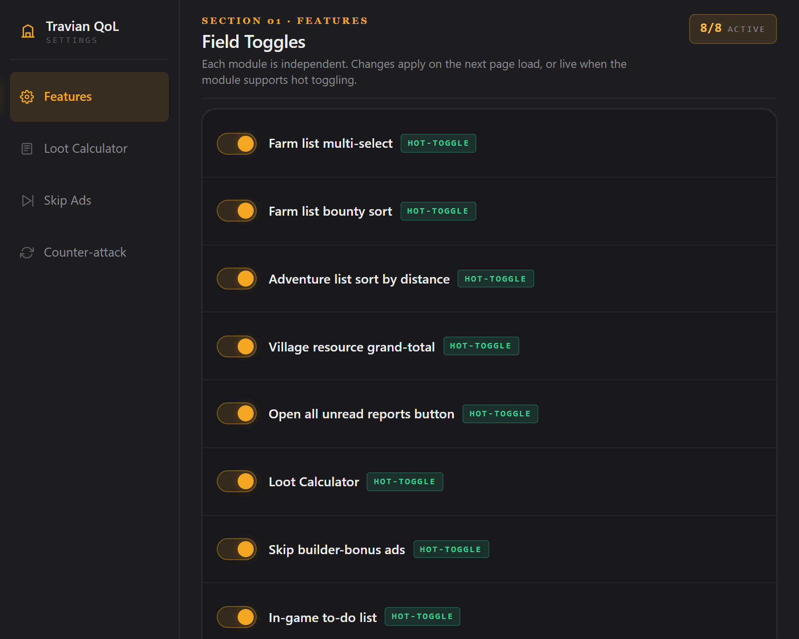</a>

Open the toolbar popup or **Options** page. Features are enabled by default and have separate toggles. **Hot-toggle** applies immediately; **On refresh** requires reloading the page.

| Feature | Usage |
| --- | --- |
| Farm-list multi-select | Click a checkbox to set an anchor. **Shift-click** changes a range to the opposite of the anchor's checked state; **Ctrl/Cmd-click** toggles a row. Checked rows are highlighted. Clicking outside lists clears selection. Check the resulting selection before sending raids. |
| Open selected farm targets | **Right-click a checked row → Open N selected targets in tabs**. Opens unique map links from that list in background tabs. No raids are sent. Escape, scrolling, or an outside click closes the menu. |
| Farm-list bounty sort | Choose **By bounty**. Orders by last bounty descending, then distance ascending for ties. Persists through list updates until another sort is selected. |
| Adventure distance sort | Open the hero adventure list. Adventures appear nearest first. |
| Village resource grand-total | Adds wood + clay + iron + crop totals beside village names on per-village resource/production statistics. |
| Open unread reports | Click **Open Unread** beside Archive. Opens unread reports from the displayed page in background tabs. |
| Loot Calculator | Select resource text, then **right-click → Calculate Troops Needed**. Choose tribe and carrying unit. Reports also show unit-count badges. Set default/per-server units in the **Loot Calculator** settings tab. |
| In-game to-do list | Add, edit, reorder, and complete village-specific tasks. Lists are saved locally; the widget can be dragged or collapsed. |
| Skip builder-bonus ads | Mutes/skips supported builder-bonus ad players. Set timing controls in **Skip Ads**. |
| Counter-attack calculator | In **Counter-attack**, enter coordinates, troop/server speeds, bonuses, and attack timings to calculate return/interception times. |

<a href="docs/images/farm-selection.png">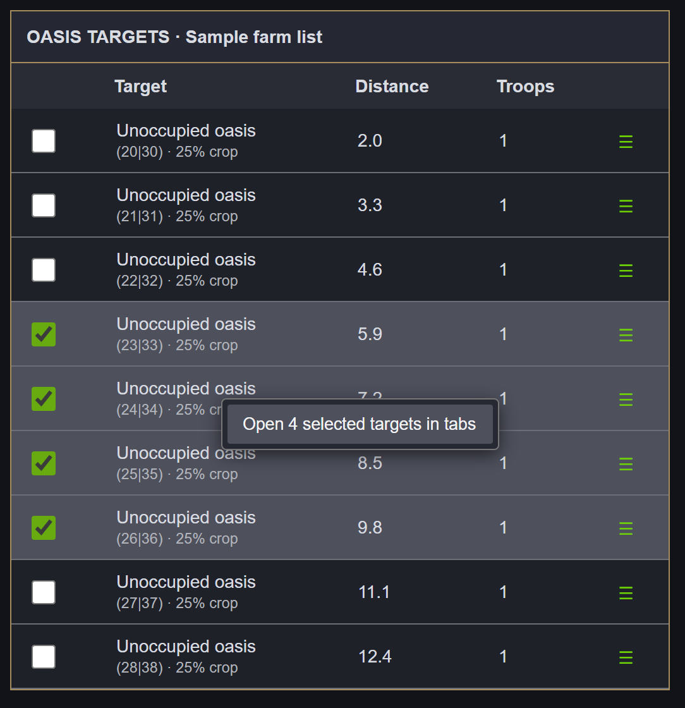</a>

The farm-list screenshot uses a sample table with the extension's selection highlight and menu.

## Rank Tracker

<a href="docs/images/rank-tracker.png">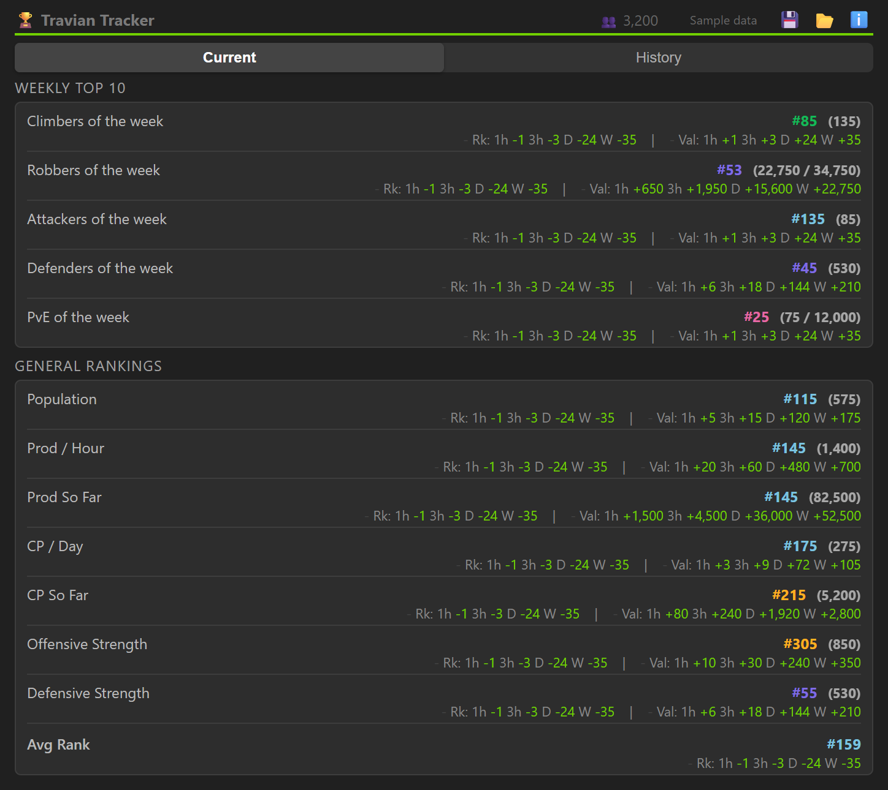</a>

**Features:** weekly Top 10/general rankings; population, production, CP, attack/defense, raid/PvE statistics; percentile tiers; historical deltas; average rank; graphs with raw data/daily peaks, absolute values/hourly velocity, metric groups, visibility controls, zoom, and point comparisons; multiple servers; JSON export/import.

**Usage:**

1. Open a logged-in Travian tab and click the extension icon to register the server and collect statistics.
2. Use **Current** for rankings and deltas. Check the update status. Background collection runs approximately every 30 minutes while the browser and session are available.
3. Use **History** to select metrics, compare points, and zoom. **Daily Peaks** aggregates observations; **Velocity** shows change per hour. Weekly statistics reset; value deltas and hourly rates bridge observed resets rather than reporting the old total as a loss. Gains during missing observations cannot be recovered.
4. Use the save icon to export data. The folder icon imports a backup and writes saved tracker data; export existing data before importing.

For expired sessions, log in and reopen the popup. Missing observations cannot be reconstructed.

<a href="docs/images/rank-history.png">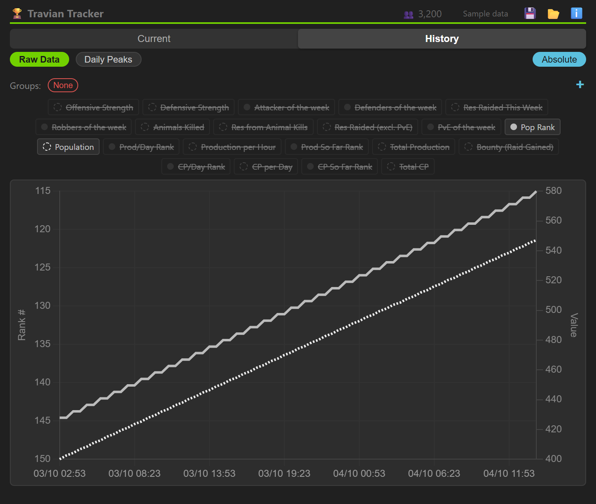</a>

## CP Predictor

<a href="docs/images/cp-planner.png">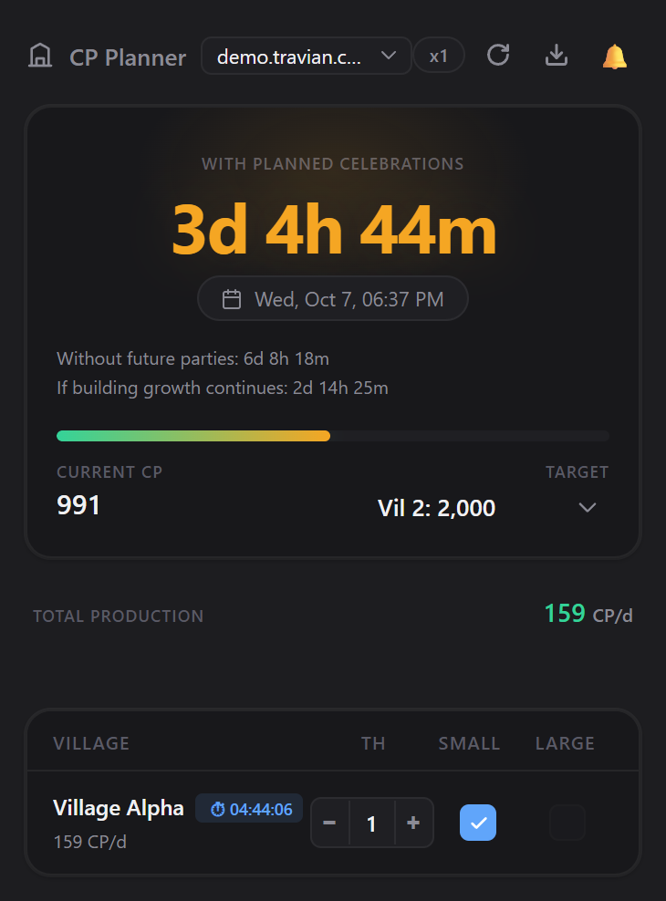</a>

**Features:** measured CP totals/production, settlement targets and ETA, per-village Town Hall levels, small/large celebration plans, cooldowns, repeated celebration queues, passive-growth projection, baseline forecast, readiness alarm/mute, multiple servers, refresh, and forecast-log export.

**Usage:**

1. Open a logged-in game tab and **CP Planner**. Select the server and settlement target; click **Refresh** for current data.
2. Check village production and Town Hall levels. Select planned small/large celebrations. Selecting both models small-then-large with cooldowns.
3. Compare the planned ETA with the baseline. You must supply resources and start the planned parties yourself. A running celebration's CP was paid at its start and is not counted again at completion.
4. Passive-growth estimates require observations spanning at least 12 hours. The readiness alarm uses observed/passive CP. Settling also requires settlers and a free expansion slot.

Refreshes roughly every five minutes. Failed refreshes retain the last snapshot. Export the forecast log when reporting an incorrect ETA.

## NPC AutoMerchant

<a href="docs/images/npc-calculator.png">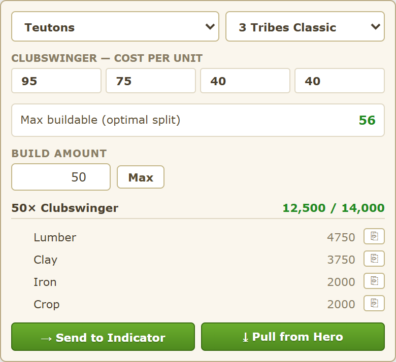</a>

**Features:** troop resource calculator, tribe/ruleset detection and overrides, unit costs, theoretical maximum count from the NPC pool, build amount, resource totals/copy buttons, per-resource deficits, saved/movable indicator, and hero-transfer assistance.

**Usage:**

1. In a training building, click the troop's **NPC exchange** control to open the calculator with that troop selected. A generic NPC dialog may lack the required troop context.
2. Check the tribe and ruleset: **3 Tribes Classic**, **5 Tribe**, or **6 Tribe Rebalanced**.
3. Enter **Build amount** or click **Max**. Max assumes an optimal NPC split of the total resource pool; actual recruitment also depends on stock distribution and queue conditions.
4. **Send to Indicator** saves the resource shortfall. **Pull from Hero** normally opens the game's transfer dialog with target amounts. Check amounts and destination before confirming.
5. If the native dialog is unavailable, **Pull from Hero** can navigate to hero inventory, fill the amounts, and submit the transfer automatically.

## InactiveSearch Map Opener

<a href="docs/images/inactive-opener.png">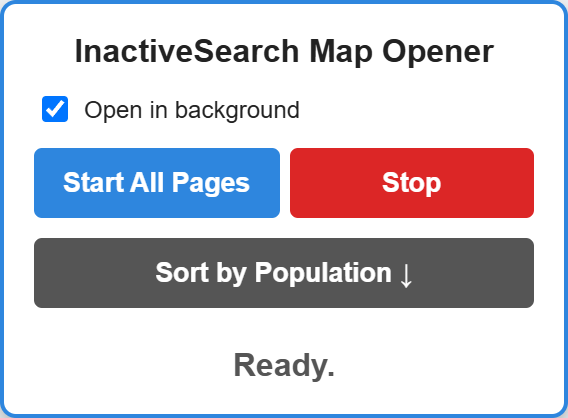</a>

**Features:** population sorting, filtered target collection across up to 100 result pages, addition to InactiveSearch's saved farmlist, queued Travian map tabs, background/foreground preference, progress status, and Stop control.

**Usage:**

1. Open your world's InactiveSearch results. Set distance, inactivity, and population filters. Check the linked Travian world and log into it.
2. **Sort by Population** reorders the current page.
3. Select **Open in background**, then **Start All Pages** to collect filtered results, save targets to InactiveSearch's farmlist, and open map tabs.
4. **Stop** cancels pending work; existing tabs remain open. Narrow filters limit the number of tabs.

This saves targets to InactiveSearch. Native Travian farm-list setup remains manual.

## Night Mode

<a href="docs/images/night-mode.png">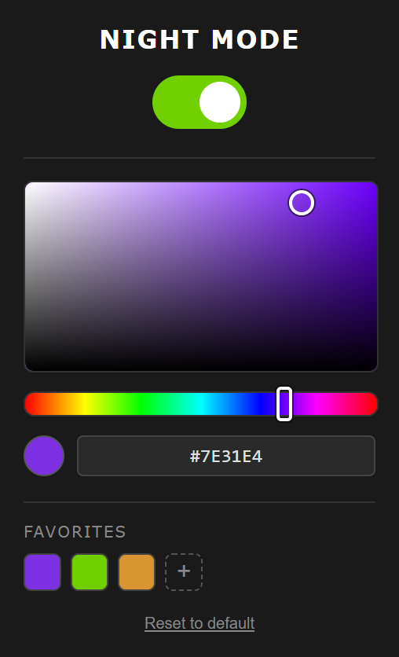</a>

**Features:** dark theme, toolbar toggle, button-color picker/hex input, live preview, up to 12 saved favorites, and native button-color reset. Enabled by default.

**Usage:**

1. Refresh Travian after installing. Toggle the theme from the toolbar popup.
2. Select a button color with the picker or hex field.
3. Click **+** to save a favorite; click a swatch to apply it or its delete control to remove it.
4. **Reset to default** restores native button colors.

## Data and permissions

Preferences, timers, histories, and caches use extension storage. Some helpers use page local/session storage for context and transfer state. QoL feature toggles use browser sync storage when available.

Statistics tools use your existing game session. InactiveSearch accesses that site's results/farmlist. Some tools open tabs, show notifications, or prepare resource transfers. Inspect each manifest for permissions. Styles can load Google Fonts and a Travian-hosted button asset. No project-operated account or analytics service is included.

## Troubleshooting and feedback

- **No interface:** check domain support, extension enablement, and the loaded folder. Refresh the game page.
- **Stale data:** log into the correct world, reopen the popup, and check refresh status.
- **Conflicts:** disable the overlapping extension or QoL feature, then refresh.
- **Update errors:** reload the extension and game tabs. Copy errors from the extension manager.

Discord: **`luckimikey`**, or [open a GitHub issue](https://github.com/mikeywikey-coding/travian-extensions/issues/new/choose). Include extension/browser versions, server domain, reproduction steps, expected/actual behavior, and screenshots or errors. Remove private details; do not share passwords, cookies, or session tokens.

For development, edit files in the relevant extension folder, reload the extension, and refresh its game page.

## Sharing

[Discord invitation](docs/DISCORD-POST.md)

## Copyright

Copyright © 2026 luckimikey. All rights reserved for original contributions to this repository.

Third-party code and assets retain their existing ownership and license terms.

## Credits

Travian and game artwork belong to their respective owners. Rank Tracker includes Chart.js with its license notice. QoL's ad helper credits DUDSS in its source.
